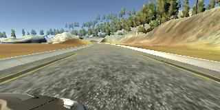

## Behavioral Cloning Project

The goals / steps of this project are the following:

#### Use the simulator to collect data of good driving behavior.
#### Build, a convolution neural network in Keras that predicts steering angles from images.
#### Train and validate the model with a training and validation set.
#### Test that the model successfully drives around track one without leaving the road.
#### Summarize the results with a written report.

1. Submission includes all required files and can be used to run the simulator in autonomous mode

My project includes the following files:

-  model.py containing the script to create and train the model.
- drive.py for driving the car in autonomous mode.
- model.h5 containing a trained convolution neural network.
- writeup_report.md this report summarizing the results.

2. Submission includes functional code

Using the Udacity provided simulator and my drive.py file, the car can be driven autonomously around the track by executing python drive.py model.h5

3. Submission code is usable and readable

The model.py file contains the code for training and saving the convolution neural network. The file shows the pipeline I used for training and validating the model, and it contains comments to explain how the code works.

Model Architecture and Training Strategy
1. An appropriate model architecture has been employed.

My model consists of a convolution neural network with 3x3 filter sizes and depths between 32 and 128 (model.py lines 18-24)

The model includes RELU layers to introduce nonlinearity (code line 20), and the data is normalized in the model using a Keras lambda layer (code line 18).

2. Attempts to reduce overfitting in the model

The model contains dropout layers in order to reduce overfitting (model.py lines 21).

The model was trained and validated on different data sets to ensure that the model was not overfitting (code line 10-16). The model was tested by running it through the simulator and ensuring that the vehicle could stay on the track.
3. Model parameter tuning

The model used an adam optimizer, so the learning rate was not tuned manually (model.py line 25).

4. Appropriate training data

Training data was chosen to keep the vehicle driving on the road. I used a combination of center lane driving, recovering from the left and right sides of the road ...

For details about how I created the training data, see the next section.

### Model Architecture and Training Strategy
1. Solution Design Approach

The overall strategy for deriving a model architecture was to ...

My first step was to use a convolution neural network model similar to the ... I thought this model might be appropriate because ...

In order to gauge how well the model was working, I split my image and steering angle data into a training and validation set. I found that my first model had a low mean squared error on the training set but a high mean squared error on the validation set. This implied that the model was overfitting.

To combat the overfitting, I modified the model so that ...

Then I ...

The final step was to run the simulator to see how well the car was driving around track one. There were a few spots where the vehicle fell off the track... to improve the driving behavior in these cases, I ....

At the end of the process, the vehicle is able to drive autonomously around the track without leaving the road.

2. Final Model Architecture

The neural network is a modified version of LeNet architecture and the following parameters modified to obtain the model with the highest validation accuracy improvement:
- Learning rate: Adam optimizer was used.
- Batch size: 64
- Dropout layer location "ELU" with fter ReLU wasa selected.
- Number of training epochs (upto 200). 40 was selected.

The neural network model consisted of the following layers:

| Layer         		|     Description	        					| 
|:---------------------:|:---------------------------------------------:| 
| Input         		| 160 x 320 x 3 RGB image                       |
| Cropping image     	| outputs 110 x 300 x 3 image  	                |
| Normalize image     	| converts values from 0-255 to 0-1 range       |
|.......................|...............................................| 
| Convolution           | 2x2 stride, 'VALID' padding, outputs 24x24x5 	|
| Activation			| ELU, alpha = 0.1								|
| Dropout               | 0.25 probability                              |
|.......................|...............................................| 
| Convolution           | 2x2 stride, 'VALID' padding, outputs 36x5x5 	|
| Activation			| ELU, alpha = 0.1								|
| Dropout               | 0.25 probability                              |
|.......................|...............................................| 
| Convolution           | 2x2 stride, 'VALID' padding, outputs 48x48x5 	|
| Activation			| ELU, alpha = 0.1								|
| Dropout               | 0.25 probability                              |
|.......................|...............................................| 
| Convolution           | outputs 64x3x3 	|
| Activation			| ELU, alpha = 0.1								|
| Dropout               | 0.25 probability                              |
|.......................|...............................................| 
| Convolution           | outputs 86x3x3 	                            |
| Activation			| ELU, alpha = 0.1								|
| Dropout               | 0.25 probability                              |
|.......................|...............................................| 
| Convolution           | outputs 86x3x3                            	|
| Activation			| ELU, alpha = 0.1								|
| Dropout               | 0.25 probability                              |
|.......................|...............................................| 
| Convolution           | outputs 24x24x5 	                            |
| Activation			| ELU, alpha = 0.1								|
| Dropout               | 0.25 probability                              |
|.......................|...............................................| 
| Flatten Input     	| outputs 100 x 1	                            |
| Dropout               | 0.25 probability                              |
|.......................|...............................................| 
| Flatten Input     	| outputs 50 x 1	                            |
| Dropout               | 0.25 probability                              |
|.......................|...............................................| 
| Fully Connected     	| outputs 10 x 1                              	|
|.......................|...............................................| 
| Fully Connected     	| outputs 1 labels                            	|
|.......................|...............................................| 

3. Creation of the Training Set & Training Process

To capture good driving behavior, I first recorded two laps on track one using center lane driving. Here is an example image of center lane driving:

alt text

I then recorded the vehicle recovering from the left side and right sides of the road back to center so that the vehicle would learn to .... These images show what a recovery looks like starting from ... :

alt text alt text alt text

Then I repeated this process on track two in order to get more data points.

    def data_augmentation (images, measurements):
        #augmenting images by flipping them horizontally
        augmented_images, augmented_measurements = [], []
        for image, measurement in zip(images, measurements):
            augmented_images.append(image)
            augmented_measurements.append(measurement)        
            augmented_images.append(np.fliplr(image))
            augmented_measurements.append(measurement*-1.0)
        return augmented_images, augmented_measurements

* The size of training set is 8,654 images. Training
train_data, validation_data = train_test_split(data, test_size=0.2)

### Data Augmentation:
The training images are biased towards left steering angles in order to increase the dataset, the following

- Flipping images
- 

To augment the data sat, I also flipped images and angles thinking that this would ... For example, here is an image that has then been flipped:

alt text alt text

Etc ....

After the collection process, I had X number of data points. I then preprocessed this data by ...

I finally randomly shuffled the data set and put Y% of the data into a validation set.

I used this training data for training the model. The validation set helped determine if the model was over or under fitting. The ideal number of epochs was Z as evidenced by ... I used an adam optimizer so that manually training the learning rate wasn't necessary.

### Multiple Cameras:

For this project, recording recoveries from the sides of the road back to center is effective. But it is also possible to use all three camera images to train the model. When recording, the simulator will simultaneously save an image for the left, center and right cameras. Each row of the csv log file, driving_log.csv, contains the file path for each camera as well as information about the steering measurement, throttle, brake and speed of the vehicle.

Left Camera image             |  Center Camera image          |  Right Camera image
:-------------------------:|:-------------------------:|:-------------------------:
  |  |  

    if i==0: #center image 
        correction = 0
    elif i==1: #left image
        correction = 0.2
    elif i==2: #right image
        correction = -0.2

As there are 43 different labels to train, it is worth noting the distribution in the number of images per label in the training, validation and training datasets.

#### 2.1 Pre-processing

#### Training the model

Mean square error was used to calculate the loss function and AdamOptimizer to optimize the loss function.

Authors: Cristian Alberch https://github.com/cristiandatum

License: This project is licensed under the MIT License. Feel free to use the code in the Jupyter Notebook as you like.